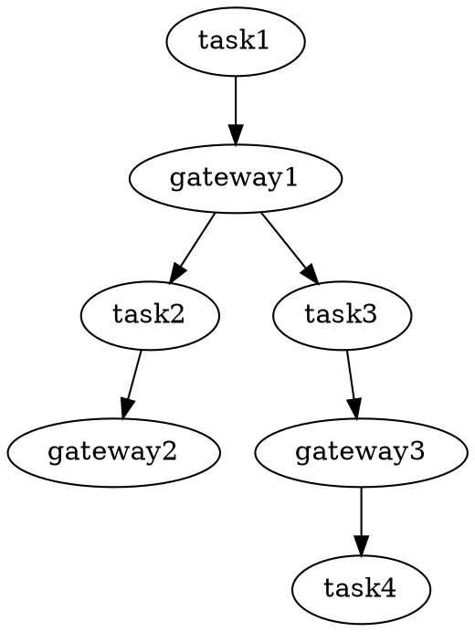

Goals
- Support generation of BPMN from Python.
- Support generation of Python from BPMN.
- Form of Python should look like Cadence examples.
- Support waits.

Design considerations
- BPMN is not a general purpose programming language, so we will most likely
  be translating from BPMN to a subset of Python.
- Python is a structured language, and does not have `goto`.  Correspondingly,
  we'll be translating to a subset of BPMN.

Design possibilities
- Python (or even JSON) data structures.
- A EDSL using overloaded Python operators.
- Python itself.

Implementation Strategies
- Strategy 1
    - Build a CFG for a decorated function.
    - Build a SSA representation for that CFG.
    - Build a BPMN task graph from the SSA form.
    - Pros: Immediately exploits parallelism in input source.  Cons: More
    development time and risks of bugs (initially).
- Strategy 2
    - Build a CFG for a decorated function.
    - Build a BPMN task graph from the CFG.
    - Pros: Faster development to a demo.  Less error prone solution.  Cons: No
    parallel gateways.
- Risks based on stuff I don't know yet:
    - Phi node conversion.  Assuming these translate into exclusive-or gateways.
    - Translation of Python expressions to FEEL-compatible expressions.

https://github.com/berndruecker/trip-booking-saga-java
https://github.com/uber/cadence-java-samples/tree/master/src/main/java/com/uber/cadence/samples/bookingsaga

## TODO's/Roadmap

- [x] Generate BPMN
- [ ] Automatically test BPMN against REXFlow
- [x] Handle function return values
    - Default is to assign to `$result` if no containing binding site
- [ ] Handle function arguments
    - First `*args`
    - Then `**kws`
- [ ] Handle `if...else` control flow
- [ ] Handle `while` control flow
- [ ] Plumbing solution
    - This refers to handling any loose Python code in the workflow,
    particularly calls to non-service functions.
- [ ] Handle package dependencies
    - [ ] User modules
    - [ ] Packages in the `${PYTHONPATH}`.
- [ ] Parallel gateways...
- [ ] Javascript support
- Nice to haves...
    - [ ] Exception control flow
        - Could include exception handling...
        - (?) What happens when an exception occurs? (I imagine Hypercorn takes
        care of it somehow...it should have a top-level exception handler.)
        What should happen?
    - [ ] Diagrams, automated layout, roundtrip support
        - This would let us use the Zeebe modeler to view and edit generated
        BPMN.

---
```python
@workflow()
def hello_workflow():
    result = hello_task()
```
==>
```python
hello_workflow = Workflow(
    n0=Start(),
    n1=ServiceTask(
        ServiceTaskWrapper(
            hello_task,
            args=[],
            returns=['result']
        )
    ),
    n2=End(),
    e0=SequenceFlow(source='n0', target='n1'),
    e1=SequenceFlow(source='n1', target='n2')
)
```
---
```python
task1()
x = task2()
task3(x)
```
==>
```python
globals1 = task1(globals0)
_old_task2 = task2
def task2(env):
    x = _old_task2()
    env['x'] = x
    return env
globals2 = task2(globals1)
globals3 = task3(globals2, x)
```
---
```python
task1()
if x > 42:
    task2()
else:
    task3()
task4()
```
==>
```python
globals1 = task1(globals0)
if (lambda env: env['x'] > 42)(globals1):
    globals2 = task2(globals1)
else:
    globals3 = task3(globals3)
globals4 = __phi__(globals2, globals3)
globals5 = task4(globals4)
```
==>

---
